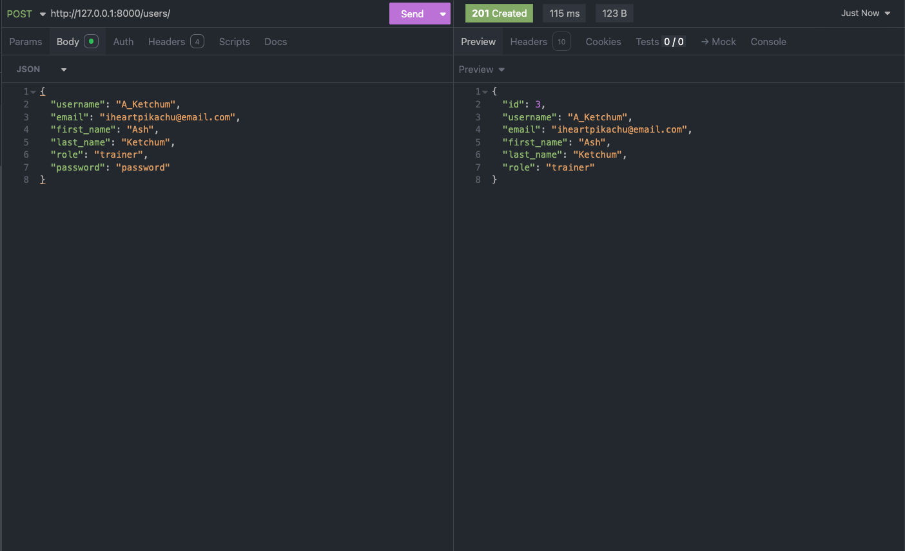
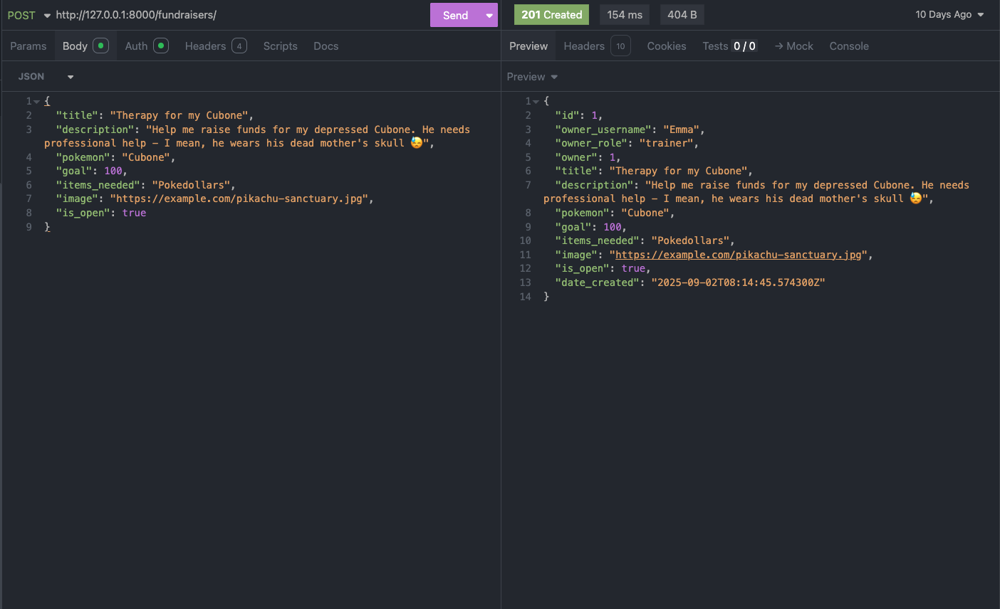
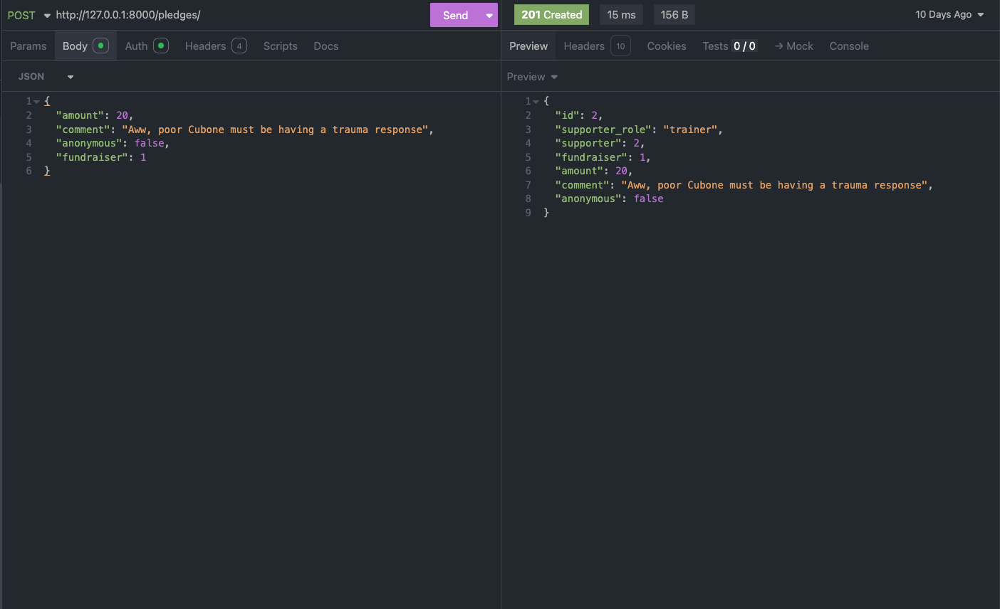
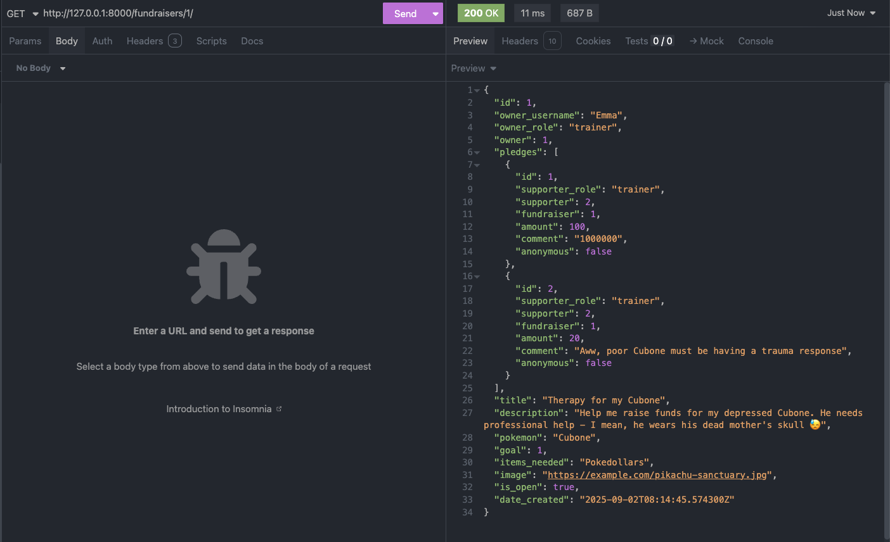
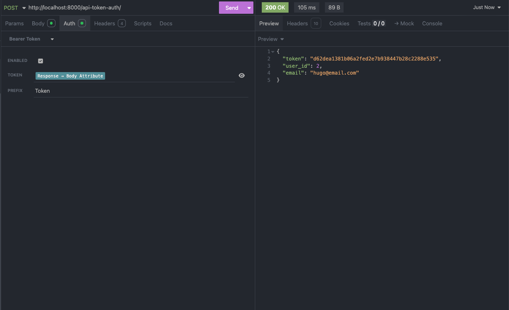

# Crowdfunding Back End
Emma Spear

## Planning:
### Concept/Name
**PokePledge** is a crowdfunding app with a whimsical, Pokémon twist. 
Trainers can create fundraisers on behalf of their Pokémon — like Snorlax asking for a beanbag chair or Eevee hoping for a special crystal to ✨ evolve ✨ — and the community can pledge support to bring those wishes to life.  

### Intended Audience/User Stories
The intended audience includes:
- **Pokémon trainers** who want to create fundraisers on behalf of their Pokémon. 
- **Pokémon Centers** who want to create fundraisers to benefit the community.
- **Safari Parks** who want to create fundraisers to raise money for Pokémon welfare. 
- **Supporters** who enjoy pledging to bring those Pokémon dreams to reality.  

### Front End Pages/Functionality
- **Home Page**
  - View fundraisers
  - Search and filter options for fundraisers
  - View stats

- **Fundraiser Detail Page**
  - Displays fundraiser description, goal, progress, and pledges.  
  - “Pledge” form for logged-in users.  
  - Preview of recent non-anonymous pledges (username, amount, comment)

- **User Account Pages**
  - Signup, log in, log out. 
  - Update account details or delete account.
  - View own fundraisers and their pledges. 
  - View pledges and monitor goal progression on pledged fundraisers.
  - Create, view, and edit own profile.

- **Create/Edit Fundraiser Page**
  - Form to create new fundraisers.
  - Ability to edit or delete fundraisers you own. 

## Additional Features

### User Profiles
- Using Django's advanced signals feature to automatically create profiles when users sign up
- No setup required: users can start using the platform immediately
- Customizable profiles with bio, showcasing their fundraisers and pledges
- Zero-error approach: every user is guaranteed to have a profile, preventing broken links or missing data

### Site Stats
- Live dashboard showing the impact of the PokePledge community
- Implemented using Django signals to ensure real-time accuracy
- Stats automatically update whenever:
  - New users join the community
  - Pledges are made to help Pokémon
  - Fundraisers successfully reach their goals
- Track key metrics like total Pokémon helped, total amount pledged, and community size
- All stats update instantly without requiring manual refresh or extra code

### API Spec

| URL                  | HTTP Method | Purpose                         | Request Body | Success Response Code | Authentication/Authorisation |
| -------------------- | ----------- | ------------------------------- | ------------ | --------------------- | ---------------------------- |
| /fundraisers/        | GET         | Fetch all the fundraisers       | N/A          | 200                   | None                         |
| /fundraisers/        | POST        | Create a new fundraiser         | JSON Payload | 201                   | Any logged in user           |
| /fundraisers/{id}/   | GET         | Fetch a single fundraiser       | N/A          | 200                   | None                         |
| /fundraisers/{id}/   | PUT         | Update fundraiser               | JSON Payload | 200                   | Fundraiser owner             |
| /fundraisers/{id}/   | DELETE      | Delete fundraiser               | N/A          | 204                   | Fundraiser owner             |
| /pledges/            | GET         | Fetch pledges                   | N/A          | 200                   | None                         |
| /pledges/{id}/       | GET         | Fetch a single pledge           | N/A          | 200                   | None                         |
| /pledges/            | POST        | Create a new pledge             | JSON Payload | 201                   | Any logged in user           |
| /pledges/{id}/       | PUT         | Update a pledge                 | JSON Payload | 200                   | Pledge owner                 |
| /users/              | POST        | Register new user               | JSON Payload | 201                   | None                         |
| /users/              | POST        | Authenticate and login user     | JSON Payload | 200                   | None                         |
| /users/              | PUT         | Edit account                    | JSON Payload | 200                   | Account owner                |
| /users/              | DELETE      | Delete account                  | N/A          |                       | Account owner                |
| /users/profile/{id}/ | GET         | Fetch a users profile           | N/A          | 200                   | Any logged in user           |
| /users/profile/{id}/ | PATCH       | Fill out / update user profile  | JSON Payload | 200                   | Profile owner                |
| /site-stats/         | GET         | Fetch site stats on fundraisers | N/A          | None                  |

### External Api
Huge shoutout to [PokéAPI](https://pokeapi.co/)! I saved a ridiculous amount of time by not having to create my own database with every single Pokémon (1,025 according to the National Pokédex 2025)

### DB Schema

[Heroku Deployment](https://pokepledge-8bbc7b3617c3.herokuapp.com/)

### Creating a New User
To create a new user, a POST request must be sent to the /users/ endpoint with a JSON payload containing the mandatory fields:
- Username
- Email
- Role
- Password

### Creating a New Fundraiser
To create a new fundraiser, a POST request must be sent to the /fundraisers/ endpoint with a JSON payload containing the mandatory fields:
- Title
- Description
- Pokemon
- Goal
- Items Needed (list)
- Image 

## Insomnia Screenshots
### Successful POST method: Create a new pledge

### Successful GET method: Fetch an individual fundraiser

### Successful Auth Token

